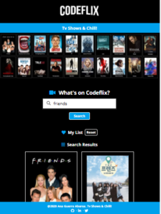

  

# **Codeflix TV Shows Search**

Module 2 final project of the Adalab Digital Frontend Development Bootcamp.

This is a responsive TV shows search web app developed with [](https://html.spec.whatwg.org/) [](https://sass-lang.com/)
[](https://www.w3.org/Style/CSS/) and [](https://www.ecma-international.org/ecma-262/)

## **Quick start guide**

Instructions to start this project:

## Installation

- Clone repository:

```
git clone [repository]
```

- Install NPM packages and dependencies:

```
npm install
```

- Run project on local server:

```
npm start
```

- **[Project URL](https://anaguerraabaroa.github.io/javascript-codeflix-shows-search/)** is also available on GitHub Pages.

## **Project features**

- TV shows search form with an input to enter show name and a button to send the request to the [**API**](http://api.tvmaze.com/search/shows?q=girls)
- Search results list with the name and an image of the show. If the show has not an image, it is shown a default image
- Select favourite shows by clicking on the show and changing background colour. Selected favourite shows remain although user do a new search
- Favourite shows list under search form
- Reset button to remove all shows from favourites list
- Close button on each favourites card to remove shows individually
- Set favourite shows on LocalStorage to get data when app is run

## **Usage**

### **1. Search**

- **Get data from API:**

```javascript
function getData() {
  let inputValue = inputElement.value;
  fetch(`//api.tvmaze.com/search/shows?q=${inputValue}`)
    .then((response) => response.json())
    .then((data) => {
      shows = data;
      renderData();
      listenFavourites();
    });
}
```

- **Render search results:**

```javascript
function renderData() {
  let html = "";
  for (let i = 0; i < shows.length; i++) {
    let classFav;
    html += `<li class="results__list--show"></li>`;
    for (let j = 0; j < favShows.length; j++) {
      if (parseInt(favShows[j].id) === shows[i].show.id) {
        classFav = "results__list--favWrapper results__list--favBorder";
      }
    }
    html += `<div class="results__list--wrapper js-favourites ${classFav}" id="${shows[i].show.id}">`;
    if (shows[i].show.image === null) {
      html += ``;
    } else {
      html += ``;
    }
    html += `<h4 class="results__list--title js-show-title">${shows[i].show.name}</h4>`;
    html += `</div>`;
    html += `</li>`;
  }
  listContainer.innerHTML = html;
}
```

### **2. Favourites**

- **Handle favourites:**

```javascript
function favouriteShows(event) {
  const currentShow = event.currentTarget;
  const currentShowName = currentShow.querySelector(".js-show-title");
  const currentShowImage = currentShow.querySelector(".js-show-image");

  const objFavShow = {
    name: currentShowName.innerHTML,
    image: currentShowImage.src,
    id: currentShow.id,
  };

  const clickedShow = parseInt(currentShow.id);
  favShowsId = favShows.map(function (element) {
    return parseInt(element.id);
  });

  const indexFav = favShowsId.indexOf(clickedShow);
  if (indexFav === -1) {
    favShows.push(objFavShow);
  } else {
    favShows.splice(indexFav, 1);
  }
  renderFavShows();
  listenRemoveBtn();
  renderData();
  listenFavourites();
  setLocalStorage();
}
```

- **Render favourite shows:**

```javascript
function renderFavShows() {
  let htmlFav = "";
  for (let i = 0; i < favShows.length; i++) {
    htmlFav += `<li class="favourites__list--favshow js-fav-show">`;
    htmlFav += `<div class="favourites__list--wrapper">`;
    if (favShows[i].image === null) {
      let defaultImg = "./assets/images/default_image.jpg";
      htmlFav += ``;
    } else {
      htmlFav += ``;
    }
    htmlFav += `<h4 class="favourites__list--title">${favShows[i].name}</h4>`;
    htmlFav += `<button class="favourites__list--button js-fav-btn"><i class="fas fa-times" id="${favShows[i].id}"></i></button>`;
    htmlFav += `</div>`;
    htmlFav += `</li>`;
  }
  favouriteList.innerHTML = htmlFav;
}
```

- **Remove shows from favourite shows list**

```javascript
function removeFavShow(event) {
  for (let i = 0; i < favShows.length; i++) {
    const removeBtnid = parseInt(event.target.id);
    const idFavShow = parseInt(favShows[i].id);
    if (removeBtnid === idFavShow) {
      favShows.splice([i], 1);
    }
  }
  renderFavShows();
  listenRemoveBtn();
  renderData();
  listenFavourites();
  setLocalStorage();
}
```

### **3. LocalStorage**

- **Set data in LocalStorage:**

```javascript
function setLocalStorage() {
  localStorage.setItem("favShows", JSON.stringify(favShows));
}
```

- **Get data from LocalStorage:**

```javascript
function getLocalStorage() {
  const localFavShows = JSON.parse(localStorage.getItem("favShows"));
  if (localFavShows !== null) {
    favShows = localFavShows;
    renderFavShows();
    listenRemoveBtn();
    listenFavourites();
  }
}
```

### **4. Reset**

- **Handle reset:**

```javascript
function handleReset() {
  favShows = [];
  inputElement.value = "";
  localStorage.removeItem("favShows");
  renderFavShows();
  listenRemoveBtn();
  renderData();
  listenFavourites();
}
```

## **Folder Structure**

```
Codeflix TV Shows Search
├── docs
├── node_modules
├── public
├── src
│   ├── html
│   │   ├── partials
│   │   │   ├── footer.html
│   │   │   ├── header.html
│   │   │   ├── hero.html
│   │   │   ├── main.html
│   │   │   ├── section-favourites.html
│   │   │   ├── section-results.html
│   │   │   └── section-search.html
│   │   └── index.html
│   ├── images
│   │    ├── default_image.jpg
│   │    ├── favicon.png
│   │    ├── landing_desktop.png
│   │    ├── landing_mobile.png
│   │    ├── landing_tablet.png
│   │    └── hero.jpg
│   ├── js
│   │    ├── 01search.js
│   │    ├── 02favourites.js
│   │    ├── 03localStorage.js
│   │    ├── 04reset.js
│   │    ├── 05removeFavourites.js
│   │    └── 06main.js
│   └── scss
│       ├── core
│       │   ├── _reset.scss
│       │   └── _variables.scss
│       ├── layout
│       │   ├── _footer.scss
│       │   ├── _header.scss
│       │   ├── _hero.scss
│       │   ├── _section-favourites.scss
│       │   ├── _section-results.scss
│       │   └── _section-search.scss
│       ├── pages
│       │   └── _index.scss
│       └── main.scss
├── .browserslistrc
├── .csscomb.json
├── .eslintrc.json
├── .gitignore
├── config.json
├── debug.log
├── gulp-flow.png
├── gulpfile.js
├── LICENSE
├── package-lock.json
├── package.json
├── README.md
└── robots.txt
```

## **License**

This project is licensed under 
