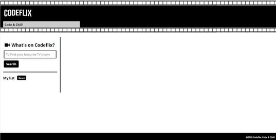

# **CodeflixSearchEngine**

Final Module 2 Exercise of the Adalab Digital Frontend Development Bootcamp.

This is a TV shows search engine app developed with [](https://html.spec.whatwg.org/) [](https://www.w3.org/Style/CSS/) and [](https://www.ecma-international.org/ecma-262/)

## **Quick start guide**

Instructions to start this project:

### **Pre-requirements**

This project runs with Adalab Starter Kit [**here**](https://github.com/Adalab/adalab-web-starter-kit).

In order to use this kit it is needed to previously install [](https://nodejs.org/es/), [](https://git-scm.com/) and [](https://gulpjs.com/) to automate tasks and control project versions.

### **Installation**

1. Clone repository
2. Open a terminal
3. Run `npm install` on the terminal to install local dependencies

### **Run project**

Run `npm start` on the terminal:

1. Open the project on the browser using a local server.
2. Refresh browser everytime files contained in `/src` folder are updated.
3. Compiled files contained in `/src` folder and copy them in `/public` folder in order to be prepared for production environment.

### **Deployment**

1. Run these commands to update changes on the project:

```
git add -A
git commit -m "Message commit"
git push
```

2. Run `npm run docs` to create `/docs` folder and the production environment version.

3. Run again commands on step 1 to update changes on the project.

4. Project **[URL](https://anaguerraabaroa.github.io/CodeflixSearchEngine/)** is also available on GitHub Pages.

## **Exercise development requirements**

- TV shows search form with an input to enter show name and a button to send the request to the [API](http://api.tvmaze.com/search/shows?q=girls)
- Search results list with the name and an image of the show. If the show has not an image, it is shown a default image
- Select favourite shows by clicking on the show and changing background colour. Selected favourite shows remain although user do a new search
- Favourite shows list under search form
- Reset button to remove all shows from favourites list
- Close button on each favourites card to remove shows individually
- Set favourite shows on LocalStorage to get data when app is run

## **Folder Structure**

```
CodeflixSearchEngine
├── images
│   ├── codeflix_search_engine.jpg
│   ├── default_image.jpg
│   └── header.png
├── js
│   └── main.js
├── styles
│   └── main.css
├── index.html
└── README.md
```

## **Listeners and functions**

### **Search**

- **Event listener:** btnElement.addEventListener("click", getData)
- **Get data from API:** function getData()
- **Render search result list:** function paintData()

### **Favourites**

- **Event listener:** function listenFavourites()
- **Handle favourites array:** function favouriteShows(event)
- **Render favourite shows list:** function paintFavShows()

### **LocalStorage**

- **Set data in LocalStorage:** function setLocalStorage()
- **Get data from LocalStorage:** function getLocalStorage()

### **Reset**

- **Event listener:** resetBtn.addEventListener("click", handleReset)
- **Handle reset:** function handleReset()

### **Remove shows from favourites list**

- **Event listener:** function listenRemoveBtn()
- **Handle shows individually:** function removeFavShow(event)

## **Result**


